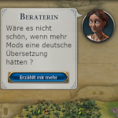

# CivVIModsGermanTranslations
> Civilization VI Mods - German translations


Deutsche Übersetzungen für diverse Civilization VI Mods.

## Übersetzte Mods

Folgende Mods - in alphabetischer Reihenfolge - wurden in diesem Mod übersetzt (Mod-Autor | Übersetzer):

1. Aircraft Carriers Perfected (NullSpace | Junky)
1. Angryr's Ancient Policies (Angryr | Junky)
1. Bonus Resource Improvements (JNR | Junky)
1. Borobudur (World Wonder) (Deliverator23 | H.Humpel)
1. Botanist (AOM | H.Humpel)
1. Brandenburg Gate (World Wonder) (Deliverator23 | H.Humpel)
1. Buddhas of Bamyan (World Wonder) (Deliverator23 | H.Humpel)
1. Burj Khalifa (World Wonder) (Deliverator23 | H.Humpel)
1. Cannabis and Hemp (AOM | H.Humpel)
1. Castles - Better Forts (JNR | Junky)
1. Civ VI Beer (AOM | H.Humpel)
1. CIVILIZATION VI: ARECIBO OBSERVATORY (Albro & Deliverator23 | H.Humpel)
1. CIVILIZATION VI: CN Tower (Albro | H.Humpel)
1. CIVILIZATION VI: EMPIRE STATE BUILDING (Albro & A CityMaker | H.Humpel)
1. CIVILIZATION VI: KINKAKU-JI (Albro & Deliverator23 | H.Humpel)
1. CIVILIZATION VI: NATIONAL WONDERS (Albro | H.Humpel)
1. CIVILIZATION VI: NATIONAL WONDERS PACK 1 (Albro | H.Humpel)
1. CIVILIZATION VI: ST PETERS BASILICA (Albro | H.Humpel)
1. District Expansion: Aqueduct (JNR | Gorowynn)
1. District Expansion: Campus (JNR | Gorowynn)
1. District Expansion: Entertainment (JNR | Gorowynn)
1. Diversity City Center Buildings (D & cyj | H.Humpel)
1. Endgame Map Replay (Technoluddite | Junky)
1. Globe Theatre (World Wonder) (Deliverator23 | H.Humpel)
1. Greatest Cities (Technoluddite | Junky)
1. Herdsman (AOM | H.Humpel)
1. Leaning Tower of Pisa (World Wonder) (Deliverator23 | H.Humpel)
1. Monopoly++: Product and Corporation Adjustments (Leugi | Junky)
1. More Maritime: Seaside Sectors (Albro | H.Humpel)
1. Motherland Calls (WindFly | H.Humpel)
1. National Projects: Satellites (JNR | H.Humpel)
1. Notre-Dame de Paris (WindFly | H.Humpel)
1. p0kiehl's Temple of Poseidon (p0kiehl | H.Humpel)
1. Porcelain Tower (World Wonder) (Deliverator23 | H.Humpel)
1. Port Lime - Bridge Districts (Captain Lime, Leugi & sukritact | H.Humpel)
1. Progressive Power Consumption (JNR | Junky)
1. Radiant Better Unit Promotions (Shirohô | Junky)
1. Raubak Natural Gas (Searching... | Junky)
1. Renewable Energy Complexity (JNR | Junky)
1. Sukritact's Oceans (sukritact | Junky)
1. Sukritact's Wat Arun (sukritact | H.Humpel)
1. Thrones and Palaces (Technoluddite | Junky)
1. Tower Bridge (World Wonder) (Deliverator23 | H.Humpel)
1. Uffizi (World Wonder) (Deliverator23 | H.Humpel)
1. Unit Expansion: Medieval Pirate Unit (D | Junky)
1. Wetlands (JNR | Junky)
1. What Did I Promise? (Technoluddite | Junky)
1. Yellow Crane Tower (WindFly | H.Humpel)


## Installation

### Steam Workshop
Die einfachste Möglichkeit dieses Mod in der letzten veröffentlichten Version zu installieren ist über die Steam Workshop Seite: https://steamcommunity.com/sharedfiles/filedetails/?id=2640245490 .

### Manuelle Installation
Für die aktuellste Version kann auch hier das Respository heruntergeladen und der dort darin enthaltene Ordner "CivVIModsGermanTranslations" in den lokalen Mod-Ordner von Civ VI kopiert werden:

```
Windows : Dokumente\My Games\Sid Meier's Civilization VI\Mods
Mac : /Users/[user]/Library/Application Support/Sid Meier's Civilization VI/Mods
Linux : ~/.local/share/aspyr-media/Sid Meier's Civilization VI/Mods
```

## Weitere Pläne
Natürlich sollen auch noch weitere Civ-VI-Mods ins Deutsche übersetzt und hier integriert werden. Aktuelle Kandidaten sind die Mods der "Urban Complexity"-Reihe. Vorschläge jederzeit willkommen.

## Danksagungen

Besonderer Dank geht an alle Civ-VI-Modder, besonders an die, deren Mods hier im Laufe der Zeit übersetzt worden sind:

- A CityMaker, Albro, Angryr, AOM, Captain Lime, cyj, D, Deliverator23, JNR, Leugi, NullSpace, p0kiehl, Searching..., Shirohô, sukritact, Technoluddite & WindFly

Und natürlich an alle User, die sich mit Übersetzungen an diesem Projekt beteiligt haben:

- Gorowynn & Junky


Und zu guter Letzt natürlich auch Dank an alle, die diesem Mod einen Preis verliehen haben.
